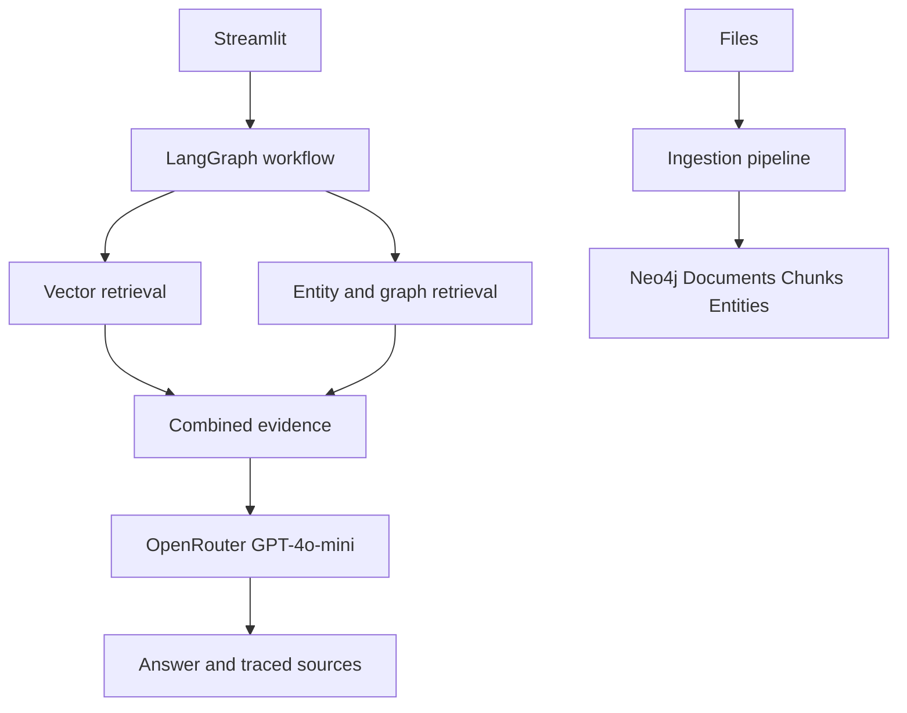

# Local GraphRAG

A modular local GraphRAG application using Streamlit, Neo4j, OpenRouter GPT-4o-mini, embeddings, and LangGraph. The application keeps ingestion, retrieval, orchestration, and evaluation independently testable.

## Architecture



## Prerequisites

- Python 3.11+
- A local Neo4j 5.x instance running without Docker
- An OpenRouter API key

Neo4j must be reachable at the URI in `.env`, commonly `neo4j://localhost:7687`.

## Setup

```powershell
python -m venv .venv
.\.venv\Scripts\Activate.ps1
pip install -r requirements.txt
Copy-Item .env.example .env
```

Set `OPENROUTER_API_KEY` and `NEO4J_PASSWORD` in `.env`. The default model is `openai/gpt-4o-mini-2024-07-18`, and the default OpenRouter base URL is `https://openrouter.ai/api/v1`. Embeddings use the configured OpenAI-compatible embedding model through the same OpenRouter endpoint.

Run the app:

```powershell
streamlit run app.py
```

## How it works

1. Upload PDF, TXT, Markdown, or DOCX files.
2. The pipeline validates the upload, selects a LangChain loader (`PyPDFLoader`, `TextLoader` for TXT/Markdown, or `Docx2txtLoader`), and returns LangChain `Document` objects with merged metadata.
3. `RecursiveCharacterTextSplitter` creates metadata-preserving chunks before embedding, structured extraction, and Neo4j `MERGE` writes.
4. The workflow analyzes each question, performs vector and entity/graph retrieval, combines deduplicated evidence, and generates an answer only when evidence exists.
5. Every source includes document, chunk, and page metadata when available.

The graph model is:

- `Document -[:HAS_CHUNK]-> Chunk`
- `Chunk -[:MENTIONS]-> Entity`
- `Entity -[:RELATED_TO]-> Entity`

The `chunk_embedding` vector index is initialized by the application for 1536-dimensional `text-embedding-3-small` vectors.

## Configuration

See `.env.example` for all settings. Important values are `CHUNK_SIZE`, `CHUNK_OVERLAP`, `TOP_K`, and `GRAPH_DEPTH`. Secrets are never logged and `.env` is ignored by Git.

## Evaluation

Edit `data/evaluation/dataset.json` with manually verified questions, expected answers, and expected sources. The evaluation modules provide deterministic token recall, source-hit, and graph entity precision/recall primitives. Results can be saved under `data/evaluation/results/` as JSON. No evaluation number is fabricated when no run exists.

## Tests

```powershell
pytest -q
```

The unit suite does not require a live Neo4j instance or API call. Live integration checks should be run separately after configuring `.env`.

## Troubleshooting

- `OPENROUTER_API_KEY is required`: set the key in `.env` and restart Streamlit.
- `NEO4J_PASSWORD is required`: set the local Neo4j password and verify the URI.
- Empty or unsupported uploads are rejected by the loader.
- If one retrieval backend fails, the workflow retains the other backend's evidence and exposes the failure in its trace.
- Without retrieved evidence, the answer is an explicit insufficiency response rather than a generated guess.

No Docker, Kubernetes, cloud deployment, or external tracking service is required.
